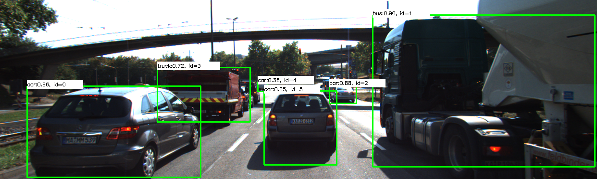
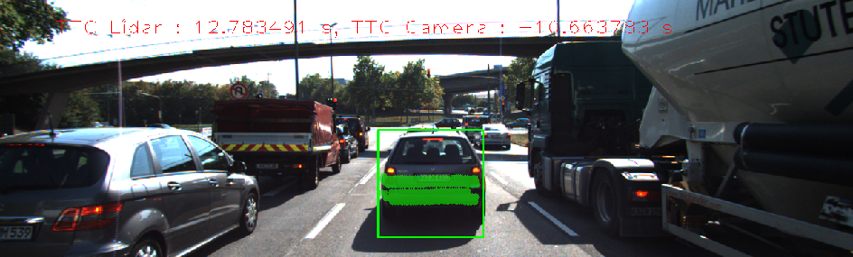

# SFND 3D Object Tracking

## Explanation of the results

The project provides Time-To-Collision (TTC) estimation to a car located in ego-line of our vehicle. TTC is estimated by involving the LIDAR data and detected keypoints from a frame of the color camera. Vehicles in camera's frames are detected by YOLO object detector (which is a part of OpenCV lib.) then keypoint detector and keypoint descriptor are involved for 2D object tracking continuously frame by frame. There is possible to choose different pairs of keypoint detector and keypoint descriptor. TTC estimation is implemented both by using the LIDAR data and keypoints of a particular vechicle. Finally, we able to track a 3D object throughout data readings from our sensors.

### Implementation of matchBoundingBoxes function
The function uses keypoint descriptor matching results for the current and the previous frame from the camera.
These matching results contain the best matched keypoint pairs from the prev and the curr. frame. YOLO object detector returns a list of detected objects' bounding boxes with confidence value for every frame. 

We should match these bounding boxes and connect each one from prev. to the curr. frame. For that, keypoints and their matching results for the whole frame are clustered for each bounding box and compared in a such way:
if two boxes contain equal pairs of keypoints then matching distances of such keypoints are accumulated; The best bounding boxes matching values are between two boxes where they have maximal accumulated value.

### LIDAR-based TTC estimation
In this step distance median value estimated from a LIDAR point cloud for each vehicle in the current and the previous frame. The relative velocity is used in the TTC estimation.
The LIDAR points were clustered accordingly to bounding box locations in the camera's frame and the distance d0 and d1 corresponds to previous distance and the current distance for the vehicle in the ego-line. There is a critical point how to match bounding boxes of the same object in the previous frame and the current. Matching results depend on chosen strategy of the bounding boxes matching and a pair of keypoint detector and keypoint descriptor.

### Camera-based TTC estimation
In this step for TTC estimation object's height (projected keypoints for a particular bounding box) projection on the image plane have been used for the current and the previous frame. Matching results strongly depend on chosen pair of keypoint detector and keypoint descriptor. The most robust results have been obtained by involving such pairs: AKAZE:AKAZE; SHITOMASHI:SIFT; AKAZE:SIFT. These combinations were more stable (in variations) for TTC value.

### Performance evaluation
As mentioned above there are scenarios where Camera-based TTC estimation provided relatively poor results. This happened in situations when a vehicle bounding box matching was incorrect due to overlapping of bounding boxes and keypoint pairs matching faults. For example, when SHITOMASHI keypoint detector was used with BRISK keypoint descriptor then Camera-based TTC has poor results:

ID, LIDAR, CAMERA
1. 12.51; -0.31
2. 12.61; -46.67
3. 14.09; -1.33
4. 16.69; -0.32
5. 15.75; -2.39
6. 12.78; -10.66

In the case SHITOMASI:SIFT results were much better than in the prev.example:
ID, LIDAR, CAMERA
1. 12.51; 18.98
2. 12.61; 13.03
3. 14.09; 13.70
4. 16.69; 13.11
5. 15.75; 14.03
6. 12.78; 16.32

The best pairs of keypoint detector and keypoint descriptor were chosen from [the previos project' report](https://github.com/shoc2005/sfustion_feature_det/blob/master/summary.pdf).

## Dependencies for Running Locally
* cmake >= 2.8
  * All OSes: [click here for installation instructions](https://cmake.org/install/)
* make >= 4.1 (Linux, Mac), 3.81 (Windows)
  * Linux: make is installed by default on most Linux distros
  * Mac: [install Xcode command line tools to get make](https://developer.apple.com/xcode/features/)
  * Windows: [Click here for installation instructions](http://gnuwin32.sourceforge.net/packages/make.htm)
* OpenCV >= 4.1
  * This must be compiled from source using the `-D OPENCV_ENABLE_NONFREE=ON` cmake flag for testing the SIFT and SURF detectors.
  * The OpenCV 4.1.0 source code can be found [here](https://github.com/opencv/opencv/tree/4.1.0)
* gcc/g++ >= 5.4
  * Linux: gcc / g++ is installed by default on most Linux distros
  * Mac: same deal as make - [install Xcode command line tools](https://developer.apple.com/xcode/features/)
  * Windows: recommend using [MinGW](http://www.mingw.org/)

## Basic Build Instructions

1. Clone this repo.
2. Make a build directory in the top level project directory: `mkdir build && cd build`
3. Compile: `cmake .. && make`
4. Run it: `./3D_object_tracking`.
